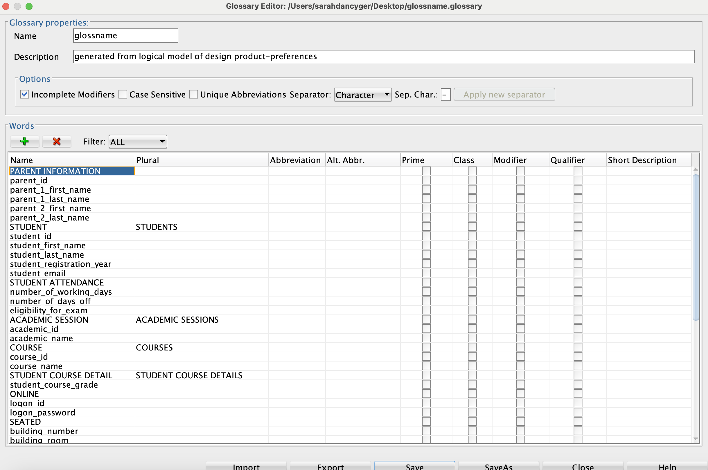
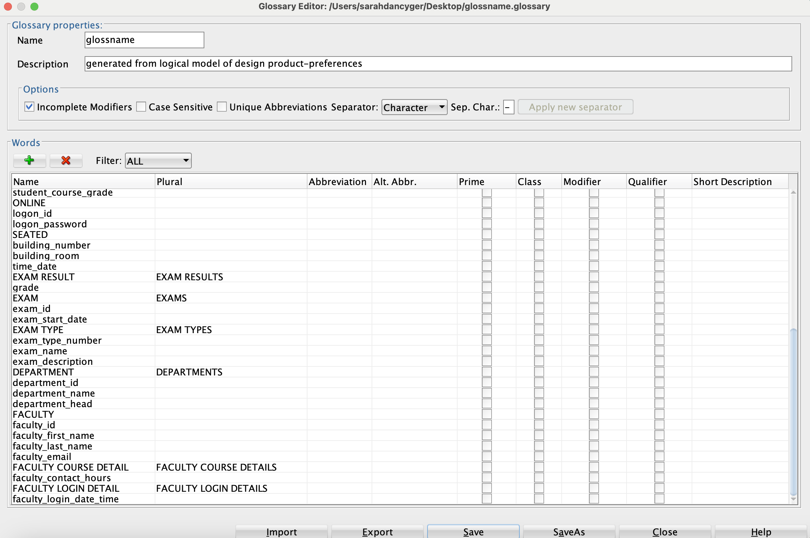

### Below please find the assignments for week 2:

# PRACTICE
## Foundations 
## DFo_4_1_sg

Exercise 0: Installing Oracle SQL Developer Data Modeler

    I was able to download the Oracle SQL Developer Data Modeler for MacOS. 

Exercise 1: Identify and Create Entities, Attributes and Relationships

    − Entities for an School Management System
        - Parent_information
        - Student
        - Student_attendance
        - Academic_session
        - Course
        - Student_course_detail
        - Department
        - Exam_result
        - Online
        - Seated
        - Exam
        - Exam_type
        - Faculty
        - Faculty_course_detail
        - Faculty_login_detail
    
    - Attributes for each of the entities identified:
        - parent_information_ID
        - parent_one_first_name
        - parent_one_last_name
        - parent_two_first_name
        - parent_two_last_name
        - student_ID
        - student_first_name
        - student_last_name
        - registration_year
        - student_email
        - number_of_working_days_off
        - number_of_days_off
        - exam_eligibility
        - academic_session_ID
        - academic_session_name
        - exam_grade
        - exam_ID
        - exam_start_date
        - seated_exam_building
        - seated_exam_room
        - seated_exam_date
        - seated_exam_time
        - online_logon_ID
        - online_password
        - course_ID
        - course_name
        - faculty_contact_hours
        - faculty_ID
        - faculty_first_name
        - faculty_last_name
        - faculty_email
        - faculty_full_time_salary
        - faculty_full_time_insurance_plan
        - faculty_part_time_hourly_rate
        - department_ID
        - department_head
        - department_name
        - student_course_grade

    − Relationship between the entities
        - The relationships between the entities help represent the data connections within the database.

## DFo_4_2_sg
Exercise 1: Forward Engineer a Logical Model to a Relational Model

## DFo_5_1_sg

## DFo_5_2_sg

## DFo_6_1_sg
## DFo_6_2_sg
## DFo_6_3_sg
## DFo_6_4_sg
## DFo_6_5_sg
## DFo_6_6_sg
## DFo_6_7_sg
## DFo_6_8_sg
## DFo_6_9_sg