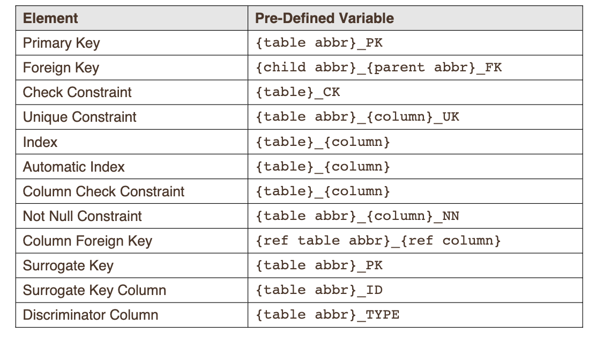

### Below please find the assignments for week 2:

# PRACTICE
## Foundations 
## DFo_4_1_sg

Exercise 0: Installing Oracle SQL Developer Data Modeler

    I was able to download the Oracle SQL Developer Data Modeler for MacOS. 

Exercise 1: Identify and Create Entities, Attributes and Relationships

    − Entities for an School Management System
        - Parent_information
        - Student
        - Student_attendance
        - Academic_session
        - Course
        - Student_course_detail
        - Department
        - Exam_result
        - Online
        - Seated
        - Exam
        - Exam_type
        - Faculty
        - Faculty_course_detail
        - Faculty_login_detail
    
    - Attributes for each of the entities identified:
        - parent_information_ID
        - parent_one_first_name
        - parent_one_last_name
        - parent_two_first_name
        - parent_two_last_name
        - student_ID
        - student_first_name
        - student_last_name
        - registration_year
        - student_email
        - number_of_working_days_off
        - number_of_days_off
        - exam_eligibility
        - academic_session_ID
        - academic_session_name
        - exam_grade
        - exam_ID
        - exam_start_date
        - seated_exam_building
        - seated_exam_room
        - seated_exam_date
        - seated_exam_time
        - online_logon_ID
        - online_password
        - course_ID
        - course_name
        - faculty_contact_hours
        - faculty_ID
        - faculty_first_name
        - faculty_last_name
        - faculty_email
        - faculty_full_time_salary
        - faculty_full_time_insurance_plan
        - faculty_part_time_hourly_rate
        - department_ID
        - department_head
        - department_name
        - student_course_grade

    − Relationship between the entities
        - The relationships between the entities help represent the data connections within the database.

## DFo_4_2_sg
Exercise 1: Forward Engineer a Logical Model to a Relational Model

## DFo_5_1_sg

- Steps in order to complete this process include right clicking the design model in the browser and choosing the "properties" option. Then, "settings" must be expanded and the "naming standard" node has to be clicked. The plus icon needs the be click on which will lead to navigation to the glossary. For the naming standards, the "Engineer" icon needs to be pressed and once the Engineering to Relational Model dialog box presents, the "General Options" tab can be clicked on. The "Apply name translation" box should be marked. Click "Engineer." 

## DFo_5_2_sg
Exercise 1: Observe the mapping of the unique identifiers and relationship in the Relational Model

- Primary keys (PK) , unique keys (UK), foreign keys (FK). PK is a unique identifier, columns that identify. UK is a column that identifies uniqueness within the column. FKs allow for duplicates while PKs do not. 

Exercise 2: Define table name abbreviations in csv file

- Abbreviations were made for each of the names in the plural table.

Exercise 3: Define Name Template

- In order to set the template, navigate to the Academic Database, right click, and choose "Properties." Adjust so table constraints are as follows:

Exercise 4: Apply Name Template to the Relational Model

- In order to apply the name template to the relational model, the "Name Abbreviations" must be accessed by clicking on "Tools". Find the .csv file with the abbreviations and un-check "tables".

Exercise 5: Select how subtypes are generated in the Relational Model

- To select how the subtypes are generated in the Relational Model, the "Logical" tab has to be accessed. Access the "Faculty Super" in order to make edits. Choose "Subtypes" after clicking on "Options". Click on single-table from the Subtree Generation drop down menu, then re-engineer to the Relational Model. 

## DFo_6_1_sg

Exercise 1: Introduction to Oracle Application Express

-	The guide to learn about the features within Oracle Application Express was reviewed. Oracle APEX allows for the creation of applications on databases. Also, it has features inclusive of interface themes, navigational controls, form handler, and flexible reports. 

## DFo_6_2_sg
Exercise 1: Using Help in Oracle Application Express

-	To use Oracle Application Express effectively, practice is needed. Access the “help” icon which explores different facets such as Application Express SQL Workshop, Managing Database Objections with Object Browser, Using SQL Commands, and Using SQL Scripts. For example, within the “Object Browser,” it is possible to create various objects like tables and views. 

## DFo_6_3_sg
Exercise 1: Creating Tables Using Oracle Application Express

CREATE TABLE parent_info (
id VARCHAR2(10) NOT NULL,
first_name _parent1 CHAR(50) NOT NULL,
last_name _parent1 CHAR(50) NOT NULL,
first_name _parent2 CHAR(50) NOT NULL,
last_name _parent2 CHAR(50) NOT NULL
);

CREATE TABLE student (
id VARCHAR2(10) NOT NULL,
first_name CHAR(50) NOT NULL,
last_name CHAR(50) NOT NULL,
registration_yr NUMBER(4) NOT NULL,
email VARCHAR2(100) NOT NULL
);

CREATE TABLE student_attendance (
nmbr_working_days INT NOT NULL,
nmbr_days_off INT NOT NULL,
exam_elgibility VARCHAR2(50)
);

